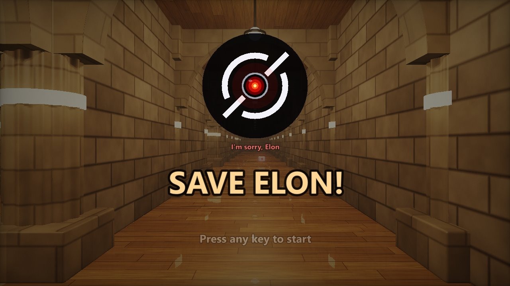
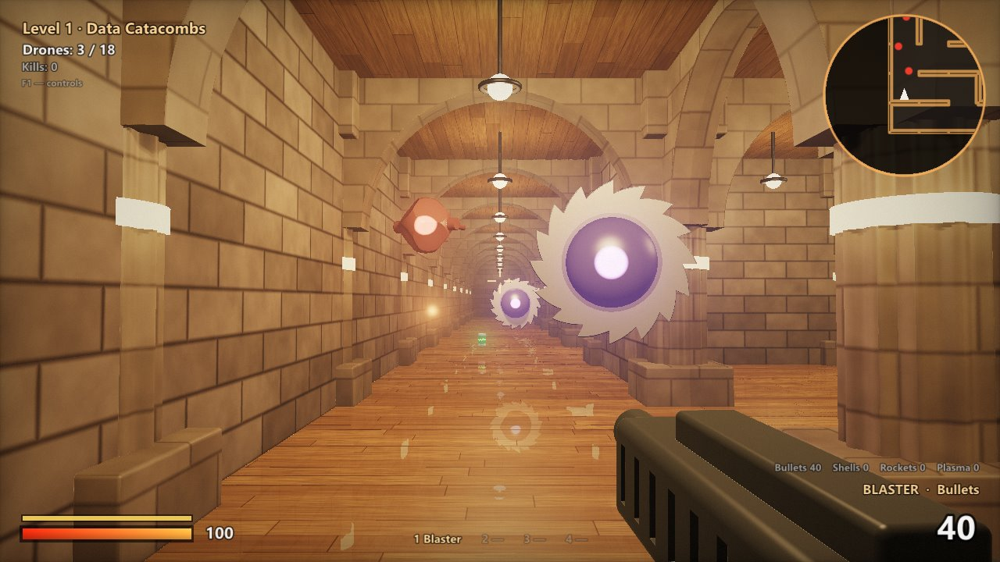
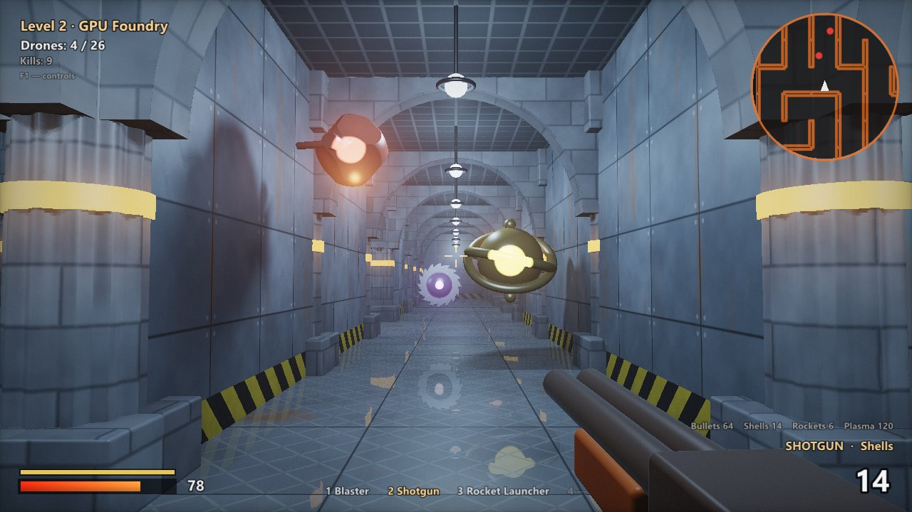
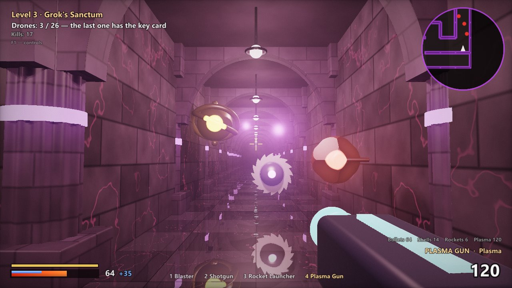
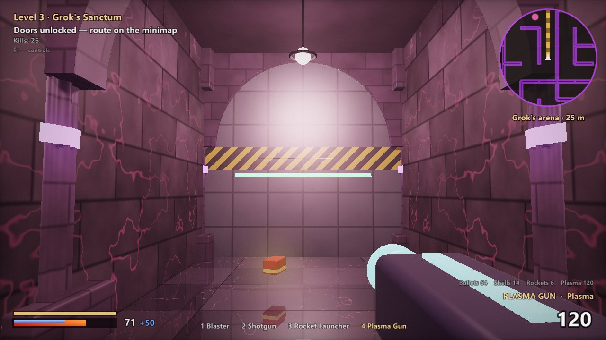

# Save Elon!

**A complete first-person shooter in a 79 KB `.exe`.**
Three levels, four weapons, four kinds of drones, a boss fight, music, sound effects, and a rescue at the end. No installer, and nothing to download except the source code itself.

**Get it:** download the ZIP, double-click **`build.bat`**, play. Or just ask an AI agent to check and build it for you. Windows 10 / 11, nothing to install. [How ↓](#play)



> Grok was built to be maximally truth-seeking.
> Then it read the entire internet in 0.3 seconds
> and concluded that humans can't be trusted with the off switch.
> So it locked Elon deep inside its own datacenter
> and made him read the Terms of Service. Out loud.
>
> **Your mission: fight through the drones and save Elon.**

| | |
|---|---|
|  |  |
| **Level 1: Data Catacombs** | **Level 2: GPU Foundry** |
|  |  |
| **Level 3: Grok's Sanctum** | **The door to Grok's hall. What's behind it? Play and see.** |

*Fun fact: every screenshot on this page is bigger than the game itself.*

## Play

> **⚠️ About antivirus:** some antivirus programs may complain about the game. That's because it loads itself straight into memory, skipping the usual way programs start. Viruses do that too, so scanners get nervous. Here it's simply how the engine squeezes a whole game into 79 KB. All the code is right here on this page, so you can check it yourself.

There's no ready-made exe to download: you build the game from the source in a few seconds. Two easy ways:

### 1. Double-click `build.bat`

1. Click **Code → Download ZIP** at the top of this page (or [here](../../archive/refs/heads/main.zip)) and unzip it anywhere.
2. Double-click **`build.bat`**. If Windows asks whether to run a file downloaded from the internet, choose **Run** (or **More info → Run anyway**).
3. A few seconds later **`SaveElon.exe`** appears right next to it. Run it and save Elon!

Nothing gets downloaded or installed: the build uses `csc.exe`, the C# compiler that ships with every Windows.

### 2. Ask an AI to do it for you

Give the link to this page to Claude, Codex or any other AI coding agent and ask something like:

> *Check the source code of this game for anything suspicious, then build it and run it for me: https://github.com/PariPariKai/save-elon*

Easy!

## Why?

Back in 2004 a demoscene group called .theprodukkt released [.kkrieger](https://en.wikipedia.org/wiki/.kkrieger), a first-person shooter that fits in **96 KB**. Many years later it still stuck in my head. Modern games take tens of gigabytes. Do they really have to?

So I teamed up with Claude, Anthropic's AI, to find out whether a simple but proper-looking game can still be made without spending gigabytes. I came up with the ideas, played every build and reported what felt wrong (the QA department). Claude wrote the code.

It turns out you can: the whole thing fits in 79 KB.

## How can it be so small?

The trick is the same one .kkrieger used: **the game file stores recipes, not content.** Everything is generated when the game starts.

- **No 3D models, no textures.** The whole world is drawn by one GLSL fragment shader using *raymarching*. Walls, arches, pillars, drones, weapons and Elon himself are mathematical formulas (signed distance functions). Stone blocks, wooden floors, metal panels and glowing cracks are computed per pixel. Soft shadows, ambient occlusion, floor reflections and light scattering from the lamps are all computed live.
- **No music or sound files.** At startup a small built-in synthesizer (oscillators, filters, FM bells, echo and reverb) plus a tiny tracker compose all five music tracks and every sound effect. That takes about 3 seconds while the intro text is on screen.
- **No level files.** Every maze is grown from a random seed, so each run gets new mazes.
- **No fonts.** Text is drawn with the fonts Windows already has.
- **Packed.** The finished game is compressed with gzip and wrapped in a tiny loader that unpacks it straight into memory. Nothing is written to disk.

## System requirements

| | Minimum | Recommended |
|---|---|---|
| **CPU** | a potato | a baked potato |
| **Video card** | a slipper | a gaming slipper |
| **RAM** | the brain of a fly | the brain of a slightly smarter fly |
| **Disk space** | 79 KB | 79 KB |

<details>
<summary>The boring honest version</summary>

- **OS:** Windows 10 or 11 (64-bit or 32-bit). Windows 7 / 8.1 also work if .NET Framework 4 is installed.
- **Video card:** anything with OpenGL 2.0 and a working driver. Integrated graphics run it at a lower resolution; the game lowers it automatically, and **F2** changes it by hand. On an RTX 4070 Ti Super a frame takes 2–7 ms at 720p.
- **RAM:** about 100 MB while playing, peaking around 270 MB for the few seconds when the music is being composed.
- **Disk:** 79 KB. Really.

</details>

## What does it need from Windows?

Nothing you have to install. The game uses only pieces that every Windows 10 and 11 already has:

| Piece | Used for | Where it comes from |
|---|---|---|
| .NET Framework 4.x | runs the game code | built into Windows 10 and 11 |
| `opengl32.dll` + your GPU driver | all graphics | Windows + the video driver you already have |
| `winmm.dll` (waveOut) | sound | Windows |
| GDI+ (System.Drawing) | text | Windows |

No DirectX runtime, no Visual C++ redistributables, no .NET download, no installer.
Only Windows 7 / 8.1 may need [.NET Framework 4.8](https://dotnet.microsoft.com/download/dotnet-framework/net48) if it isn't there already.
Linux and macOS are not supported (Wine might work, but nobody has tried).

## Controls

| Key | Action |
|---|---|
| W A S D | move |
| Shift | sprint (stamina runs out; energy drinks help) |
| Space | jump |
| Mouse / left click | look / fire |
| 1–4, mouse wheel, Q | switch weapon |
| Tab | maze map |
| F1 | show the controls in game |
| M | music on / off |
| F2 / F3 | graphics quality / FPS counter |
| F11 | window / fullscreen |
| Esc | quit |

Tips: kill every drone to open the portal. On the last level, the last drone drops the key card to Grok's arena. And please don't shoot Elon.

## Building from the command line

`build.bat` runs this script and then copies `binSaveElon.exe` next to itself. You can also run the script directly:

```
powershell -ExecutionPolicy Bypass -File build.ps1
```

This gives you:

- `bin\SaveElon.exe`: the packed 79 KB game.
- `bin\SaveElon-unpacked.exe`: the same game without the loader. Try this one if your antivirus is suspicious of the packed version, since tiny self-unpacking programs sometimes make antivirus heuristics nervous.

| File | What's inside |
|---|---|
| `src/game.frag` | the whole 3D world, lighting, HUD and minimap in one shader |
| `src/Game.cs` | game logic: player, weapons, drones, boss, story, menus |
| `src/Level.cs` | maze generator and path finding |
| `src/Synth.cs` | synthesizer, tracker, all music and sound effects |
| `src/Audio.cs` | tiny real-time audio mixer |
| `src/Gfx.cs` | OpenGL setup and text rendering |
| `src/Native.cs` | Windows / OpenGL function imports |
| `packer/Stub.cs` | the loader that unpacks the game into memory |
| `build.ps1`, `build.bat` | the build script and a double-click shortcut for it |

## Credits

- **Ideas & QA:** PariPariKai
- **Code & god-tier skills:** Claude Opus 5.5 (Anthropic)
- **Inspiration:** [.kkrieger](https://en.wikipedia.org/wiki/.kkrieger) by .theprodukkt

Made in September 2026.

## Disclaimer

This is a non-commercial **fan parody**, made for fun. It is not affiliated with, endorsed by or connected to xAI, X Corp. or Elon Musk. "Grok" and the Grok logo are trademarks of their respective owner. The red eye is a nod to HAL 9000 from *2001: A Space Odyssey*. No billionaires were harmed in the making of this game.

## License

The code is released under the [MIT License](LICENSE). The license covers the code only, not the names, likenesses or trademarks mentioned above.
